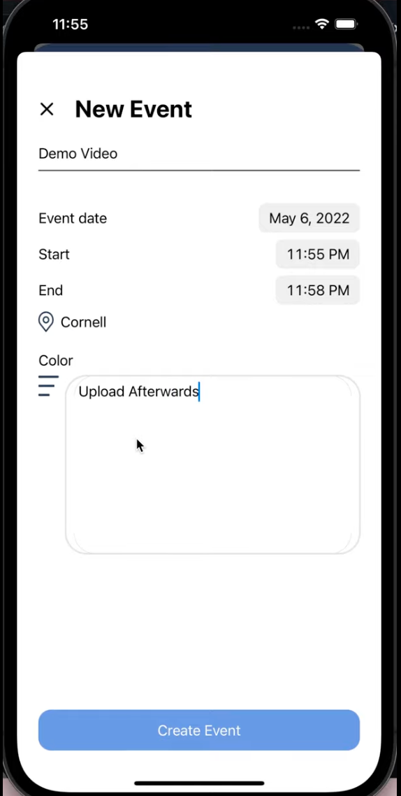

### Summary
- PlanMate is an iOS app designed to enhance productivity and organization. With its intuitive interface, users can effortlessly create events, allocate time for important tasks on their calendars, and generate comprehensive to-do lists.
- This app streamlines the process of event planning by enabling users to set up events with relevant details and reminders. Moreover, it empowers users to effectively manage their time by blocking off specific periods in their calendars, ensuring undisturbed focus on crucial activities. Additionally, the app's to-do list feature allows users to compile and prioritize tasks, promoting efficient task completion. Whether it's managing events, optimizing time usage, or tackling tasks, the Task Manager app serves as an all-in-one solution for users striving to stay organized and maximize productivity.
- I worked as a backend developer to help create this application as part of a 2-week hack challenge hosted by Cornell AppDev.

### Relevant technologies
- Flask, SQLalchemy
- Dockerfile, docker-compose.yml for google cloud deployment

### Team
- 4 developers
  - 3 backend (Jeremy Jung, Yallen Bai, and me!)
  - 1 frontend (Abigail Castro)
- 1 designer (Tiffany Lee)

### The app features three pages...
- Home page
  - 
- Calendar page
  - 
- Tasks page
  - 

### Using the app
  - Sign up and create a new account
  
  - Create a new event 
  
  - Create a new task
  

### Relevant links
- Checkout our backend repo [here](https://github.com/triple-jay/backendhackchallenge)!
- Click [here](https://github.com/triple-jay/backendhackchallenge#readme) for an explanation of our database model.
- Interested in viewing our [API specification](https://docs.google.com/document/d/1dRZiPb49iOvGMvkG6XusQtS2edt8dsEkdhFH_o3Qy_A/edit?usp=sharing)?

Click [here](https://youtu.be/1iEAlHVln-I) for a demonstration of our app!
